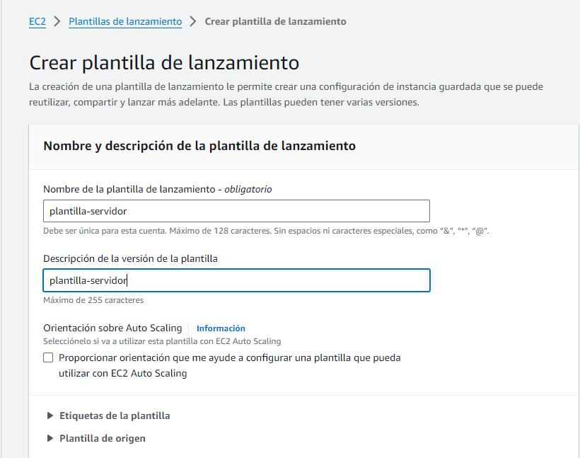

# ⚒️ Creació d'una plantilla de llançament.

Una plantilla de llançament  és una especificació que defineix els paràmetres necessaris per a llançar instàncies EC2 idèntiques. És similar a una configuració de llançament, ja que especifica informació de configuració per a les instàncies EC2, com ara: &#x20;

* L’ID de l'Amazon Machine Image (AMI).&#x20;
* El tipus d’instància.&#x20;
* Un parell de claus.&#x20;
* Els grups de seguretat.&#x20;
* ...

Per a crear una plantilla de llançament, hem d'accedir al panell EC2. Introduïm EC2 al buscador, i seleccionem l'opció corresponent al llistat de serveis.

<figure><figcaption></figcaption></figure>

Al panell EC2, seleccionem l'opció 'plantilles de llançament'.

<figure><figcaption></figcaption></figure>

I prenem el botó 'crear plantilla de llançament'.

<figure><figcaption></figcaption></figure>

Omplim el formulari, amb el nom i la descripció de la plantilla.

<figure><figcaption></figcaption></figure>

Busquem l'AMI desitjada, fent servir el buscador (a l'exemple, farem servir Ubuntu 22.04).

<figure><figcaption></figcaption></figure>

Seleccionem el tipus d'instància, i el parell de claus, per accedir a la mateixa.

<figure><figcaption></figcaption></figure>

Configurem els grups de seguretat a aplicar a les instàncies (preferiblement haurien d'estar creats, però a l'exemple, els crearem sobre la marxa).

<figure><figcaption></figcaption></figure>

<figure><figcaption></figcaption></figure>

Despleguem l'opció detalls avançats.

<figure><figcaption></figcaption></figure>

I busquem l'opció dades d'usuari, en la que copiarem l'script inicial que executaran les màquines durant la seua primera arrancada. Per a l'exemple, farem servir el següent script, que insta-la Apache2, PHP, i crea un fitxer PHP de prova.

```bash
#!/bin/bash
sudo apt update;
sudo apt upgrade -y;
sudo apt install -y apache2 php libapache2-mod-php;
sudo a2enmod php8.1;
sudo systemctl restart apache2;
sudo rm -rf /var/www/html/index.html
cat <<EOF | sudo tee /var/www/html/index.php
<?php
  echo \$_SERVER['SERVER_ADDR'];
  echo '<br>';
?>
EOF
```

Finalment, prendrem el botó 'crear plantilla de llançament'

<figure><figcaption></figcaption></figure>
