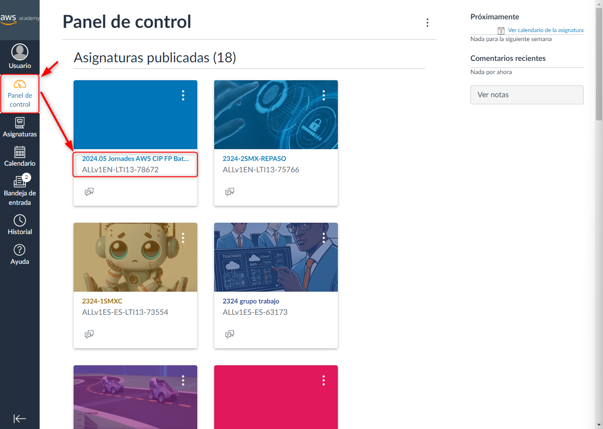

# ⚒️ Matriculació d'alumnat a un curs

Una volta creat el nostre curs, el següent pas és afegir a l'alumnat, per tal que puga fer les seues tasques.&#x20;

Al LMS, haurem de buscar el curs, i polsar sobre el nom d'aquest. Al nostre exemple, entrarem al curs 2024.05 Jornades AWS ...

<figure><figcaption></figcaption></figure>

Una volta dins del curs, accedirem a l'opció People, del menú vertical a l'esquerra.

<figure><figcaption></figcaption></figure>

A la pàgina 'People', podrem observar l'alumnat i el professorat afegit al curs. Si prenem el botó +People, ens deixarà afegir usuaris al curs.&#x20;

<figure><figcaption></figcaption></figure>

L'aplicació ens mostrarà un formulari, al qual podem afegir un llistat de correus electrònics, per tal d'enviar una invitació al curs als propietaris d'aquests.&#x20;

Cal afegir els diferents correus electrònics, un per línia, seleccionar el rol que volem assignar als nous usuaris i polsar el botó 'Next'.

<figure><figcaption></figcaption></figure>

Si la plataforma no té registrats usuaris amb els correus electrònics afegits, ens demanarà que introduïm el nom dels usuaris, i que marquem la casella a l'esquerra del nom, per a confirmar que volem enviar la invitació al curs. Després haurem de prendre el botó 'Next'

<figure><figcaption></figcaption></figure>

Tornarem a la finestra 'People', en la qual podrem visualitzar les invitacions pendents, i les acceptades.&#x20;

<figure><figcaption></figcaption></figure>

Cada alumne afegit rebrà un correu electrònic, per tal d'acceptar la invitació (les invitacions no seran enviades fins a la publicació del curs).

<figure><figcaption></figcaption></figure>

