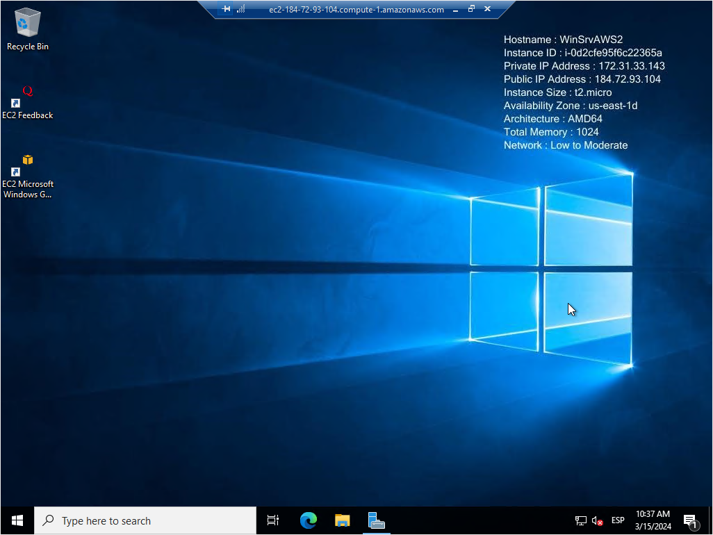

# ⚒️ UDXX-04.- Desplegament d'una màquina virtual Windows Server 2022 a AWS Academy

En primer lloc, [accedim a la consola d'AWS](broken-reference).

<figure><figcaption>
Consola d'AWS
</figcaption></figure>

En el buscador, introduïm les sigles 'EC2', i seleccionem l'opció 'EC2 - servidors virtuals en el núvol'.

.png>)&#x20;

A la pàgina d'instàncies podrem polsar sobre el link 'instancies en execució' i visualitzar el llistat d'instàncies desplegades a la nostra infraestructura al núvol d'AWS. &#x20;

<figure><figcaption>
Opció 'instàncies en execució' del panel EC2
</figcaption></figure>

<figure><figcaption>
Llistat d'instàncies desplegades
</figcaption></figure>

Per a desplegar una nova instància, haurem de polsar sobre un dels botons 'Llançar instància'.

<figure><figcaption>
Botó llançar instància.
</figcaption></figure>

Omplim el formulari, seguint les instruccions de l'assistent de desplegament de nova instància.&#x20;

* Introduïm el nom de la nova instància. Al nostre exemple l'anomenarem Windows server

<figure><figcaption>
Configuració del nom de la instància
</figcaption></figure>

* Seleccionem la imatge de sistema operatiu i aplicacions (AMI - Amazon Machine Image) que volem carregar a la nova instància. Al nostre cas, seleccionem un Windows Server 2022 base de 64 bits.

<figure><figcaption>
Selecció d'imatge base
</figcaption></figure>

* Seleccionem el tipus d'instància que volem desplegar, que determinarà la configuració del processador i la memòria de la instància. Al nostre cas, farem servir instàncies t2.micro, aptes per a la capa gratuïta de serveis, per tal d'abaratir els costos del nostre laboratori.

<figure><figcaption>
Selecció de tipus d'instància.
</figcaption></figure>

* Seleccionem el parell de claus que farem servir per a desencriptar la contrasenya d'accés RDP que farem servir per a connectar a la instància de manera remota, amb un client RDP. Podem crear un nou parell de claus o seleccionar un parell de claus prèviament generades i utilitzades a altra instància EC2.

<figure><figcaption>
Selecció d'un parell de claus existent.
</figcaption></figure>

* A la configuració de xarxa podem seleccionar els grups de seguretat (regles de tallafoc) que volem aplicar a la nova instància.  Aplicarem els grups de seguretat rdp-internet i internet, creats amb anterioritat, per a permetre que la instància puga accedir a internet, i nosaltres puguem connectar des d'internet a la instància per protocol RDP.

<figure><figcaption>
Configuració dels grups de seguretat
</figcaption></figure>

* Farem scroll fins a trobar l'opció 'Llançar instància', i el polsarem, per a aprovisionar la mateixa.&#x20;

<figure><figcaption>
Llançar la instància
</figcaption></figure>

Rebrem un missatge, indicant que la nova instància ha iniciat correctament, i un enllaç per poder veure totes les instàncies del nostre entorn virtual. Polsem sobre el botó 'Veure totes les instàncies'.

<figure><figcaption>
Informació sobre la creació de la nova instància
</figcaption></figure>

Podem observar totes les instàncies en execució, i podem seleccionar una instància, per tal de comprovar els seus paràmetres:

<figure><figcaption>
Informació de la instància en execució
</figcaption></figure>

Ara podem connectar per RDP a la instància EC2, amb un client RDP. Seleccionem la instància, i polsem el botó 'Connectar'.

En polsar el botó, ens mostrarà una finestra, amb la informació de connexió. Si polsem sobre l'opció 'Client RDP', podrem descarregar un fitxer de connexió amb RDP

<figure><figcaption>
Informació de connexió a la instància
</figcaption></figure>

Per a poder connectar amb RDP, necessitarem la contrasenya de l'usuari administrador. Per tal d'aconseguir-la, hem de polsar sobre el botó 'obtindre contrasenya' localitzat més a baix.

<figure><figcaption>
Enllaç per a obtindre la contrasenya.
</figcaption></figure>

En polsar l'enllaç, ens mostrarà un formulari per a importar la nostra clau privada, associada a la instància. En importar-la i polsar el botó 'Desxifrar contrasenya', ens mostrarà la contrasenya de l'administrador de la instància.&#x20;

<figure><figcaption>
Obtenció de la contrasenya d'accés de l'administrador.
</figcaption></figure>

Ara podem connectar amb un client d'escriptori remot que done suport al protocol RDP:

<figure><figcaption>
Connexió amb una ferramenta d'accés a escriptori remot
</figcaption></figure>

<figure><figcaption>
Confirmació de la connexió
</figcaption></figure>

Una volta connectats, podem començar a operar la instància, com si estiguérem físicament davant d'un PC amb la mateixa configuració.

<figure><figcaption>
Pantalla de l'escriptori remot de Windows Server 2022 base
</figcaption></figure>

<figure><figcaption>
Pantalla de l'escriptori remot de Windows Server 2022 base
</figcaption></figure>
