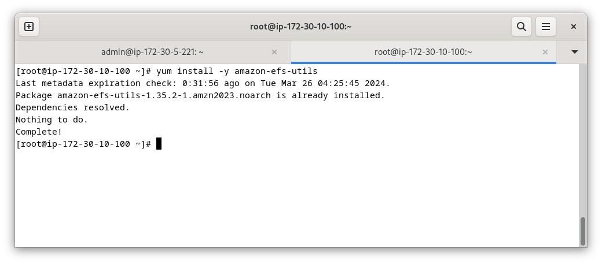

# 📎 Pràctica EFS

L'objectiu d'aquesta pràctica es compartir una carpeta **EFS** amb dues instàncies **EC2**. En aquest cas una instància serà un GNU/Linux Debian i l'altra instància un Amazon Linux.

Ja tenim les 2 instàncies EC2 en funcionament:

<figure><figcaption></figcaption></figure>

Ara crearem un sistema de fitxers **EFS**, i per això hem d'accedir al servei .png>), ens hem d'assegurar que estem dins de la nostra **VPC** i que fem servir el nostre grup de seguretat.&#x20;

<figure><figcaption></figcaption></figure>

Finalment, així és com queda el nostre sistema de fitxers **EFS**:

<figure><figcaption></figcaption></figure>

Ara accedirem al servei **EC2** per connectar-se a les instàncies i muntar el sistema de fitxers creat, farem servir la connexió amb client **ssh**:

&#x20;

<figure><figcaption></figcaption></figure>

Abans de res ens assegurarem que disposem instal·lat el client **NFS** per a Debian:

<figure><figcaption></figcaption></figure>

Tornem al servei EFS per "_**Asociar**_" el sistema de fitxers EFS, montem fent servir el client NFS i comprovem:

<figure><figcaption></figcaption></figure>

A continuació tornarem accedirem al nostre servei **EC2**, ara farem servir la instància d'Amazon Linux.

<figure><figcaption></figcaption></figure>

En aquest cas farem servir l'auxiliar de connexió d'**EFS**, aquest està disponible al repositori d'Amazon Linux:

<figure><figcaption></figcaption></figure>

Montem i comprovem que hem accedit el sistema de fitxers EFS:

<figure><figcaption></figcaption></figure>

Si volem que el nostre sistema de fitxers **EFS** estiga disponible en iniciar la nostra instància sols hem d'afegir una línia al fitxer **/etc/fstab:**

<figure><figcaption></figcaption></figure>

Ara modificarem la nostra instància Debian per muntar de forma automàtica el sistema de fitxers **EFS**. Farem servir el client **NFS** en el fitxer **/etc/fstab**:

<figure><figcaption></figcaption></figure>
