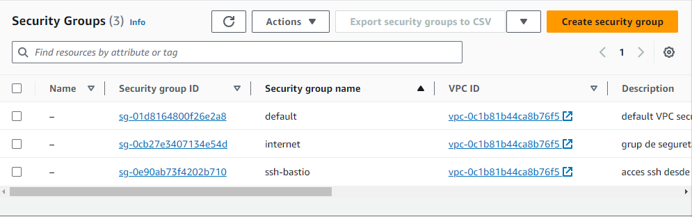

# ⚒️ Configuració del grup de seguretat 'ssh-bastio'.

A continuació, configurarem el grup de seguretat 'ssh-bastio', que permetrà el tràfic d'entrada al port TCP/22 (SSH), des de qualsevol IP, a les instàncies que apliquen el grup de seguretat.&#x20;

Dins de la pàgina de grups de seguretat, polsem el botó "Crear nou grup de seguretat".

<figure><figcaption>
Llistat de grups de seguretat
</figcaption></figure>

Introduïm les dades bàsiques del grup de seguretat 'internet' (nom, descripció i VPC).

<figure><figcaption>
Configuració del nom i la descripció
</figcaption></figure>

Configurem la regla d'entrada requerida, habilitant la connexió al port TCP/22 (SSH) des de qualsevol IP.

<figure><figcaption>
Regles d'entrada
</figcaption></figure>

Deixem el panell de regles d'eixida buit.

<figure><figcaption>
Regles d'eixida
</figcaption></figure>

I polsem sobre el botó 'Crear grup de seguretat' per a finalitzar la configuració.&#x20;

<figure><figcaption>
Confirmació de la creació del grup de seguretat
</figcaption></figure>

Tornarem al llistat de grups de seguretat, a on podrem comprovar que el grup de seguretat s'ha creat correctament.

<figure><figcaption>
Llistat de grups de seguretat
</figcaption></figure>

