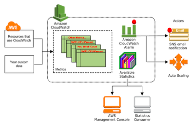

# ⚒️ Monitoritzar instancias con CloudWatch

Podem monitoritzar les instàncies mitjançant Amazon CloudWatch.&#x20;

Aquest recull i processa les dades sense format d'Amazon EC2 i les converteix en mètriques llegibles pràcticament en temps real.

Aquestes estadístiques es registren durant un període de 15 mesos, de manera que pugui obtenir accés a informació d'historial i obtenir una perspectiva millor sobre l'exercici de la seva aplicació web o servei.

<figure><figcaption></figcaption></figure>

Per defecte, Amazon EC2 envia les dades de les mètriques a CloudWatch en períodes de 5 minuts. La consola d'Amazon EC2 mostra una sèrie de gràfics basats en dades sense format d'Amazon CloudWatch.&#x20;

En funció de les vostres necessitats, és possible que preferiu obtenir les dades de les instàncies d'Amazon CloudWatch en comptes dels gràfics que es mostren a la consola.

<figure><figcaption></figcaption></figure>
