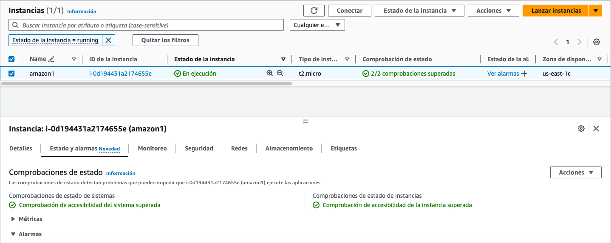

# ⚒️ Monitorizar instàncies manualment.

<figure><figcaption></figcaption></figure>

Una altra part important de la monitorització d'Amazon EC2 implica la monitorització manual dels elements que no cobreixen els scripts, les comprovacions d'estat i les alarmes de CloudWatch.&#x20;

Els panells de consola d'Amazon EC2 i CloudWatch proporcionen una vista ràpida de l'entorn d'Amazon EC2. El tauler d'Amazon EC2 mostra:

* L'estat del servei i esdeveniments programats per regió.
* L'estat de la instància.
* Les comprovacions d'estat.
* L'estat de l'alarma.
* Detalls de les mètriques de la instància (al panell de navegació, triem Instàncies, seleccionem una instància i premem la pestanya Monitorització.
* Detalls de les mètriques del volum (al panell de navegació, triem Volums, en seleccionem un i polsem la pestanya Monitorització).&#x20;

<figure><figcaption></figcaption></figure>

Amb el monitoratge d'estat de les instàncies, podeu determinar ràpidament si Amazon EC2 ha detectat algun problema que pogués impedir a les instàncies executar aplicacions.&#x20;

Amazon EC2 realitza verificacions automatitzades a cada instància EC2 en execució per identificar problemes de maquinari i de programari.&#x20;

Hi ha dos tipus de comprovacions d'estat:

* Comprovacions d'estat de sistemes.
* Comprovacions d'iestat d'instàncies.
