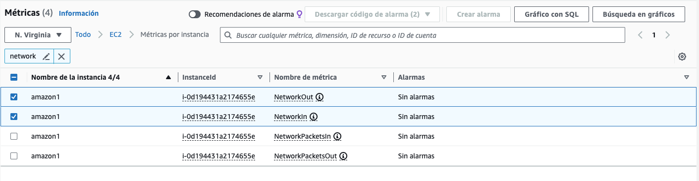

# 1. Mètriques de CloudWatch

Utilitzant les mètriques de CloudWatch obté les estadístiques per a:&#x20;

Nombre de bytes rebuts i enviats per la instància en una de les interfícies de xarxa.

Obrim la consola de CloudWatch.

Al costat esquerre de la pantalla, trobaràs el panell de navegació de CloudWatch. Busca i selecciona "Metrics".

<figure><figcaption></figcaption></figure>

Trieu l'opció Mètriques per instància.

<figure><figcaption></figcaption></figure>

A la pantalla de mètriques, selecciona "EC2" a la secció "Per namespace".

Selecciona "Per Instance" a la secció "By".

Selecciona la instància específica de la qual vols veure les mètriques de xarxa.&#x20;

<figure><figcaption></figcaption></figure>

Després, busca la mètrica "NetworkIn" per als bytes rebuts i "NetworkOut" per als bytes enviats. Aquestes mètriques són les que t'indicaran la quantitat de dades rebudes i enviades, respectivament.

<figure><figcaption><p>Sel·lecció de mètriques</p></figcaption></figure>

Després de seleccionar "NetworkIn" o "NetworkOut", et portarà a una pantalla on pots veure la mètrica en forma de gràfic.

Pots ajustar l'interval de temps per veure les dades d'un període específic.

<figure><figcaption><p>Mètriques diagramades</p></figcaption></figure>

<figure><figcaption></figcaption></figure>

Per obtenir les dades numèriques exactes, pots fer clic en l'opció "Graphed metrics" i seleccionar "View data in a table".

Això et mostrarà una taula amb els valors numèrics dels bytes rebuts o enviats durant el temps seleccionat.

<figure><figcaption></figcaption></figure>


```
sudo stress --hdd 1 --io 4
stress --hdd 1 --hdd-bytes 1G

```

Practica tú mateix i obté les següents mètriques:

1. Operacions de lectura i escriptura completades un dels volums del magatzem d'instàncies disponibles per a la instància en un període de temps especificat.
2. Percentatge d'unitats informàtiques EC2 assignades que es fan servir actualment a la instància (ús de cpu).
